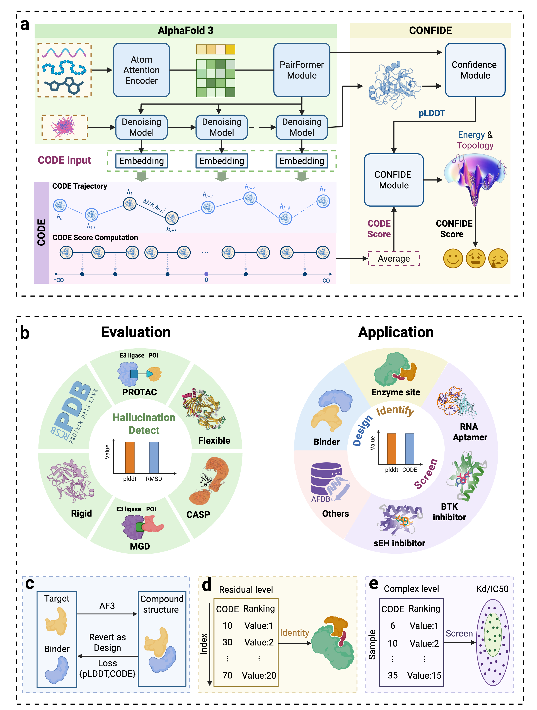

# CODE & CONFIDE

CODE, a latent-space trajectory–based metric, and CONFIDE, an integrated score that jointly quantify topological and energetic frustrations underlying unreliable AlphaFold3 predictions.

## Overview
Inspired by the topological frustration theory in protein folding, we reformulated the diffusion embedding trajectories of the AF3 series structure predictors into CODE, a metric that captures topological frustration overlooked by the conventional confidence metric pLDDT. We propose CONFIDE, a unified framework integrating topological frustration and pLDDT-represented energetic frustration to comprehensively characterize the protein folding energy landscape.



## Getting Started

### Prerequisites

- Python 3.10
- Required Python packages (see Installation section)

### Installation
1. For basic installation instructions, please refer to the [Boltz-1 repository](https://github.com/jwohlwend/boltz.git).


2. Clone the repository:
```bash
git clone https://github.com/zjgao02/CONFIDE.git
cd CONFIDE
```


### Usage

#### Data Preparation

First, you need to construct YAML files for Boltz1 predict. You can refer to 'examples/prot_no_msa.yaml'.

Next, for saving the CODE trajectory, you can modify the path in https://github.com/zjgao02/CONFIDE/blob/b436e7c762ab3c6ded1c816e833b8385eec0cee9/src/boltz/data/write/writer.py#L82

#### Inference

Then you can run inference using Boltz with:

```bash
boltz predict input_path --out_dir output_path --cache ./
```

#### Data Analysis
You can get the confidence score directly from the Boltz output, which represents the energy frustration.

After that you can run the code.py code to perform energy combination analysis in CONFIDE:

```bash
python code.py
```


## Contact

If you have any questions, please feel free to contact the authors.

- Zijun Gao (zjgao24@cse.cuhk.edu.hk)
- Chunbin Gu (guchunbin200888@gmail.com)
- Changyu Hsieh (kimhsieh@zju.edu.cn)
